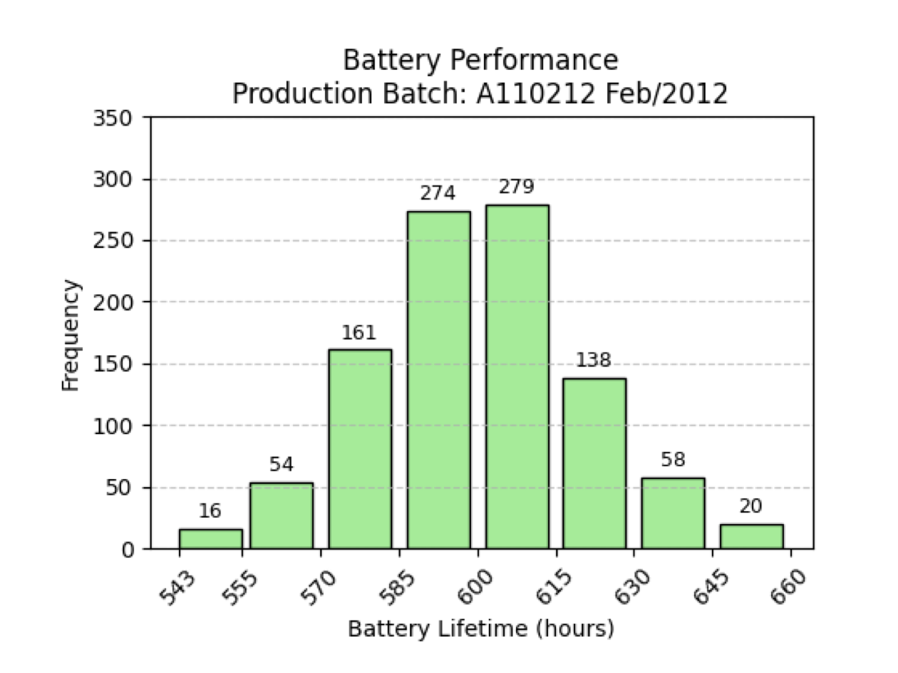

```{r setup, include=FALSE}

knitr::opts_chunk$set(echo = TRUE)

```


# Case Study 1: Evaluating the Battery Lifespan in a New Production Line

This case study explores the influence of the new production line of the company's reliable and long-lasting batteries. With the company's Production Manager Kevin, his concerns on the possibility of new batch underperforming have led us to explore a solution using hypothesis testing.   


### Importing the dataset

```{r battery data, echo=TRUE}

setwd("/Users/ad/Desktop/Studies/MMU/Trimester 2/Statistical Data Analysis/Assignment 2")
batteryData <- read.csv("BatteryLifeNew.csv")

```


### Overview of the dataset 

A brief explanation on the observations below.

```{r description, echo=TRUE}

head(batteryData)
summary(batteryData)

```


## Part A: Descriptive Statistics 

Below is a chart illustrating the old batch of the battery performance.

```{r include-image, echo=FALSE, out.width="0.5\\textwidth"}



```

To estimate the mean and standard deviation of the old batch of VoltCell Ultra batteries, we extracted the bin midpoints based on the range, as well as the frequencies from the provided histogram. Using the midpoint method, we calculated the estimated mean and standard deviation, which provide a summary of the battery lifespan and its variability in the old production line. These estimates serve as a comparison with the new batch. 

```{r old-batch, echo=TRUE}

batteryMidpoints <- c(549, 562.5, 577.5, 592.5, 607.5, 622.5, 637.5, 652.5) # midpoints 
batteryCFrequencies <- c(16, 54, 161, 274, 279, 138, 58, 20) # cumulative frequencies 

# estimated mean 
meanEstimated <- sum(batteryMidpoints * batteryCFrequencies) / sum(batteryCFrequencies)

# estimated sd 
varEstimated <- sum(batteryCFrequencies * (batteryMidpoints - meanEstimated)^2)
sdEstimated <- sqrt(varEstimated)

cat("The estimated mean battery lifetime is:", round(meanEstimated, 2), "hours\n")
cat("The standard deviation is:", round(sdEstimated, 2), "hours\n")

```

As for the new batch, we imported the raw battery lifespan data from **BatteryLifeNew.csv**. We calculated the sample mean and standard deviation to summarize the new production line's battery lifespan. 

```{r new-batch, echo=TRUE}

meanNew <- mean(batteryData$LifetimeHrs)
sdNew <- sd(batteryData$LifetimeHrs)

cat("The sample mean of new batch is:", round(meanNew, 2), "hours\n")
cat("The sample standard deviation of new batch is:", round(sdNew, 2), "hours\n")

```

Additionally, we computed the **95% confidence interval** for the mean using a t-test, which gives a range of values for the true mean battery lifespan of the new batch. This range gives us insight on whether the new production line is likely to meet the company's standard of 600 hours. 

```{r confidence-interval, echo=TRUE}

n <- length(batteryData$LifetimeHrs)
se <- sdNew / sqrt(n) # Error 
t_critical <- qt(0.975, df = n - 1) # two-tailed
t_margin <- t_critical * se
CI_lower <- meanNew - t_margin  
CI_upper <- meanNew + t_margin 

cat(sprintf("The 95%% confidence interval for the mean is: [%.2f, %.2f] hours\n", CI_lower, CI_upper))

```


## Part B: Visualization 

In Part B, we visualize the distribution of the new battery lifespan data and assess its normality. The histogram with an overlaid normal curve provides a visual check for data's distribution, while the Q-Q plot and Shapiro Wilk-test offer quantitative evidence.

```{r hist-new-batch}

hist(
  batteryData$LifetimeHrs,
  breaks = 20,
  probability = TRUE,
  main = "Histogram of New Battery Lifespan",
  xlab = "Battery Lifetime (hours)",
  col = "teal",
  border = "skyblue2"
)

# overlay normal curve
curve(
  dnorm(x, mean = meanNew, sd = sdNew),
  col = "yellow2",
  lwd = 2,
  add = TRUE
)

legend("topright", legend = c("Histogram Density", "Normal Curve"),
       col = c("skyblue2", "yellow2"), lwd = c(2, 2), lty = c(1, 1))

qqnorm(batteryData$LifetimeHrs, main = "Q-Q Plot of New Batch")
qqline(batteryData$LifetimeHrs, col = "yellow2", lwd = 2)

# Shapiro-Wilk Test 
shapiroResult <- shapiro.test(batteryData$LifetimeHrs)
shapiroResult

if (shapiroResult$p.value > 0.05) {
  cat("The Shapiro-Wilk test shows that the battery lifespans follow a normal distribution.")
} else {
  cat("The Shapiro-Wilk test shows that the battery lifespans does not follow a normal distribution.")
} 

```

Based on the Shapiro-Wilk test outcome, the code outputs that the battery lifespans follow a normal distribution, showing that it has a large p-value as required (>0.05). 


## Part C: Hypothesis Testing 

To decide if VoltPlus should continue with the new batch, we apply hypothesis testing to decide whether they live up to their standards and their justification of their own tagline "VoltCell  Ultra – Powering Your World for 600 Hours and Beyond!".

```{r hypothesis-testing, echo=TRUE}

sampleData <- batteryData$LifetimeHrs
hypothesisMean <- 600

# t-test
tTest = t.test(sampleData, mu = hypothesisMean, alternative = "less", conf.level=0.95)
tStat = tTest$statistic
degFreedom = tTest$parameter
pVal = tTest$p.value 

cat("T-statistic:", round(tStat, 2), "\n")
cat("Degrees of freedom:", degFreedom, "\n")
cat("P-value:", round(pVal, 4), "\n")

# check if h0 should be rejected at a < 0.05
if (pVal < 0.05) {
  cat("Since p-value is less than 0.5, we reject the null hypothesis.")
} else {
  cat("Since p-value is greater than or equal to 0.05, we fail to reject the null hypothesis.")
}
```

From the hypothesis testing above, it is observed that the p-value is less than 0.5, hence we reject the null hypothesis. This shows that the new production line of the battery lifespan, is underperforming, as opposed to meeting the standards. Based on this analysis, VoltPlus Technologies should consider discontinuing the new production line. 

# Case Study 2: Analysis on the Sales of the New Mango Zing flavor.

This second case study explores the impact of the new drink flavor, Mango Zing on sales. As the company would like to understand if Mango Zing has caused a significant change in overall sales and whether the sales of existing drinks (like Cola Classic, Lemon Light, and Berry Blast), we use statistical methods like ANOVA and correlation analysis to examine these changes. 


### Importing the dataset

```{r FreshFizz-data, echo=TRUE}

setwd("/Users/ad/Desktop/Studies/MMU/Trimester 2/Statistical Data Analysis/Assignment 2")
dfFreshFizz <- read.csv("FreshFizz.csv")

dfFreshFizz$Date <- as.Date(dfFreshFizz$Date)
dfFreshFizz$Total_Sales <- as.numeric(dfFreshFizz$Total_Sales)
dfFreshFizz <- na.omit(dfFreshFizz)

```


### Overview of the dataset 

A brief explanation on the observations below.

```{r description, echo=TRUE}

head(dfFreshFizz)
summary(dfFreshFizz)

```


## Part A: Plotting and Summary Statistics 

To get a better understanding of the daily sales for FreshFizz, we use a line chart to show trends over time so that it can help illustrate how sales change day by day. 

```{r line-chart}

plot(dfFreshFizz$Date, dfFreshFizz$Total_Sales, 
     type = "l",          
     col = "lightpink2",        
     lwd = 2,             
     main = "Daily Total Sales (2024)", 
     xlab = "Date", 
     ylab = "Total Sales ($)")          

```

Based on the line chart above, we observe that the trend in daily total sales in 2024 is generally upward, signaling that sales are increasing over time. The sales values shift between **$12,000 and $20,000**, suggesting variability in daily sales throughout the year. This range suggests that while there are consistent sales generally, there are also days with significantly lower and higher sales, as the chart displays volatitlity, with peaks and troughs. 

We then plot a side-by-side boxplot of daily sales to summarize the mean and the standard deviation of the daily total sales before the pre-launch **(Before June 1) and post-launch (After June 1)** of Mango Zing to determine if this new product has contributed any changes to the sales of the company. 

```{r comparison-period, echo=TRUE}

library(dplyr)

# new column to differentiate the two time periods 
dfFreshFizz$Period <- ifelse(dfFreshFizz$Date < as.Date("2024-06-01"), "Pre-Launch (Before June 1)", "Post-Launch (After June 1)")

salesComparison <- summarise(group_by(dfFreshFizz, Period),
                    Mean = mean(Total_Sales, na.rm = TRUE),
                    SD = sd(Total_Sales, na.rm = TRUE),
                    Difference = Mean - SD)

salesComparison

```

```{r boxplot-comparison-period, echo=TRUE}

boxplot(Total_Sales ~ Period, data = dfFreshFizz,
        main = "Daily Total Sales: Pre-Launch vs Post-Launch",
        xlab = "Period", 
        ylab = "Total Sales ($)",
        col = c("skyblue2", "yellow2"))

```

Since launching Mango Zing, FreshFizz's average daily sales increased by $14,654.25 — 
a positive contribution, despite the increase in standard deviation of $13,095.90. Both the comparison table and boxplot indicate that the new flavor significantly boosted FreshFizz's revenue in the second half of the year. 


